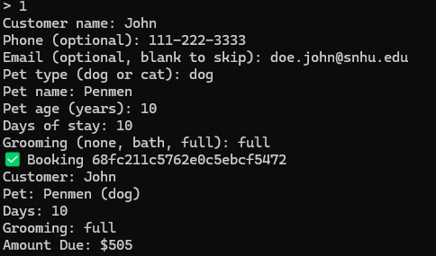
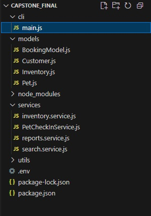
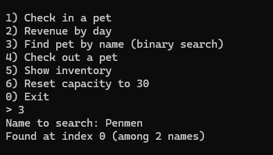

# CS499 ePortfolio – Pet Check-In

** Rikki Xaysanasy**
B.S. Computer Science (Information Security), expected December 2025
Email: rikki.xaysanasy@snhu.edu

## Start here

This ePortfolio shows my CS-499 Capstone work. It includes a professional self-assessment, three connected technical artifacts (Software Engineering and Design, Algorithms and Data Structures, and Databases), and short notes on algorithms and security.

### How the artifacts fit together
- **Software Engineering and Design:** I refactored the original console idea into clear models with consistent naming and responsibilities.
- **Algorithms and Data Structures:** I added queues, stacks, hash maps, and binary search to improve fairness, speed, and control.
- **Databases:** I connected to MongoDB, enforced schema rules, added light indexing, and used an atomic capacity update to prevent double booking.


Together, these artifacts show that I can move a simple idea into a maintainable, testable, and safer system. They set the stage for the rest of the portfolio by showing the range of my skills, from design and algorithms to persistence and security.

## Run instructions

### Requirements
- Node 20+ (or current LTS)
- MongoDB 7+ (local or a cloud connection string)

## How to run on macOS / Linux
1. Install Node 20+ (or current LTS) and MongoDB 7+.
2. Copy `.env.example` to `.env` in `Capstone_Final/` and set `MONGODB_URI=...`.
3. In `Capstone_Final/` run:
   ```bash
   npm install
   npm run start:cli
   
## Original Artifact
.java)

My original artifact, PetCheckIn(1).java, was written when I first learned Java in IT-145. It stores pet info and space counts in public fields, includes a constructor with getters and setters, imports a Scanner, and has an empty main method, so nothing runs. It mixes console input into setters, compares strings with == instead of .equals, has a “cat” branch that assigns “dog,” and uses local variables that never update the fields. nextInt() leaves a newline that breaks the next nextLine(). There is no validation or range checking, space counts are magic numbers, the Scanner is never closed, and the class blends UI with the data model. My plan is to make fields private, use getters and setters that validate, replace magic values with constants, and use an enum or named constants for pet type. Setters will accept values, normalize and validate them, then assign to this.*, while all console I/O moves to main or a small helper so the class is easy to test. I will add checks for name, age, type, spaces, and days, add computeAmountDue(dailyRate) to tie the bill to days, include toString() for display, and create a small main demo that prompts safely, calls setters, computes the amount, prints a summary, and closes the Scanner.


## Screenshots
### Console App Runs
  
*Booking created after capacity check; shows booking ID and bill summary.*

### Software Engineering and Design
  
*Project layout showing `cli/`, `models/`, and `services/`.*

### Algorithms and Data Structures
  
*Binary search result for pet name: found index and list size.*

### Databases
  
*MongoDB Compass: bookings collection with daysStay, amountDue, status, and timestamps.*

# Self-Assessment

This self-assessment shows how my coursework and ePortfolio strengthened my skills, clarified my values, and made me more employable in computer science. I first planned a web app version of PetCheckIn but chose a command line interface to focus on core logic, data structures, and database rules within the course timeline. It gives a quick overview of my abilities with clear examples from school and work.

I collaborate by keeping work small, visible, and easy to hand off. I use Git branches, clear commits, and short status updates. For PetCheckIn, I split work into models, routes, and tests so tasks could move in parallel. My communication is short and focused on decisions: what changed, why, and what is next. In milestones and journals, I listed status, risks, and next steps in plain language. At work, I do the same for inspection readiness, downtime, and recovery plans, using simple visuals and avoiding jargon.
   
I apply practical data structures: binary search for fast lookups, queues for fair order, and stacks for undo. In PetCheckIn, a queue manages check-ins and a stack allows quick rollback. I think about time and memory costs and choose what fits the goal. I moved from a single file console sketch to a cleaner design with clear schemas (Customer, Pet, Booking, Inventory). I push rules into the data layer, add small indexes, and use atomic updates to prevent double booking. This keeps controllers thin and testing simple.

Security is built in from the start. I use environment variables for secrets, least privilege for data, input validation, and logging that matters. I plan for race conditions and misuse, and I am adding basic threat modeling and hardening.

###### Outcome 1: 
I build collaborative environments by keeping work small, visible, and easy to hand off. I use Git branches for features, write clear commit messages, and share short status updates. For my PetCheckIn work, I split tasks by models (Customer, Pet, Booking, Inventory), routes, and tests so work could run in parallel. At my current employment, I use the same style in operations: short stand-ups, a simple board for priorities, and clear owners. These habits support fast decisions across different audiences, including engineers, operators, and managers.

###### Outcome 2: 
I communicate in a way that is clear and useful to the audience. From my CS-250 course on software development life cycles, I took on roles of product owner, scrum master, developer, and tester. For stakeholders, I focus on what changed, why it changed, and what happens next. In class milestones and journals, I used short sections for status, risk, and next steps. For technical readers, I provide code comments, API notes, and concise diagrams. For non-technical readers, I avoid jargon and tie points to cost, schedule, quality, or safety.

###### Outcome 3: 
I started with a plan for a web app. I moved to a command line interface to control scope and focus on the main problem. This let me design simple flows, test logic faster, and show clear use of queues, stacks, and binary search. The trade off is less UI, but stronger proof of algorithmic design and clean data handling. I choose data structures and algorithms that match the goal. In PetCheckIn, a queue supports first in, first out check-ins, and a stack lets me undo the last action if a mistake occurs. I consider input size, time complexity, and memory cost. When I refactor code, I favor simple, predictable logic that is easy to test. I write down trade offs so others understand why I picked a structure or pattern.

###### Outcome 4: 
I moved from a basic console sketch to a cleaner web style structure. I defined simple schemas (Customer, Pet, Booking, Inventory) and pushed rules into the data layer so controllers stay thin. I added small indexes to speed common searches and used a single atomic update to prevent double booking. I test small pieces, handle async flows carefully, and use environment variables for configuration. These choices reduce defects, make performance predictable, and keep the system easier to extend. At work, I apply the same approach to processes: define the flow, add checks where they matter, and measure outcomes. The goal is always value, reliability, speed, and easier maintenance.

###### Outcome 5: 
I design with security in mind from the start. From my CS-465 full stack development course, I learned to keep secrets in environment variables, restrict database permissions to the minimum, and validate inputs before writes. I plan for failure modes such as race conditions, stale reads, and double booking. I prefer patterns that make risky actions atomic and logged. From my INFOSEC work, I focus on privacy, minimal data collection, and clear audit trails. As I grow, I am adding basic threat modeling and system hardening so I can spot and reduce risks earlier.

Building the ePortfolio pushed me to clean my designs, explain my choices, and plan for real world risks. It also helped me connect my classroom work to my career goals in security and systems. I now have a clear story for employers: I deliver simple, reliable, well documented solutions that teams can trust and extend.


